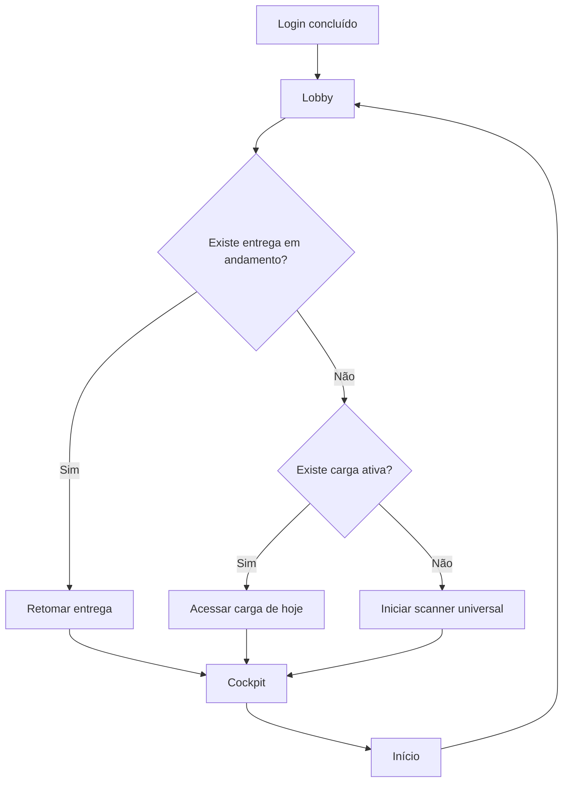

# V0.5.3 — Lobby e Cockpit

## Objetivo

Separar a abertura do aplicativo da operação de campo. O **Lobby** oferece
orientação curta e informações de contexto; o **Cockpit** conserva o painel de
scanner e a operação híbrida já homologados.

## Estrutura visual proposta

### Lobby do entregador

| Área | Conteúdo | Regra |
|---|---|---|
| Cabeçalho | `Olá, Allan` e ponto `COM REDE`/`SEM REDE` | nome do perfil ativo; sem consulta adicional |
| Saúde da conta | selo verde `Modo Piloto Ativo` | configuração local preparada para futuro plano, sem cobrança |
| Resumo | `Entregas na semana` e `Pendentes hoje` | calculado pelo estado já disponível no aparelho |
| Avisos | versão instalada, sincronização pendente ou carga recebida | sem logs técnicos e sem alertas invasivos |
| Ação principal | `ACESSAR CARGA DE HOJE` ou `INICIAR SCANNER UNIVERSAL` | texto muda conforme exista carga ativa |
| Retomada | `RETOMAR ENTREGA EM ANDAMENTO`, quando aplicável | prioridade sobre iniciar nova leitura |

### Cockpit preservado

O Cockpit é a tela atual de operação híbrida: progresso de carga quando houver,
operações livres do dia, última leitura, copiar código, abrir aplicativo e
scanner na zona inferior do polegar. A única inclusão será uma ação discreta
`INÍCIO` no cabeçalho.

## Fluxo de navegação

## Proteções obrigatórias

- O Lobby não pode apagar, duplicar ou sincronizar dados por conta própria.
- Se câmera estiver ativa, a ação `INÍCIO` encerra a câmera antes de navegar.
- Se houver POD em preenchimento, o app oferece **Retomar**; não descarta foto,
  assinatura ou recebedor.
- Nenhum contador consulta Firebase em tempo real: o Lobby lê o cache/carga
  já carregados para preservar o uso offline e o plano Spark.
- Avisos técnicos ficam no painel SUPORTE; o entregador recebe apenas status
  operacional curto.

## Critérios de aprovação visual

1. Em um toque, o entregador chega ao scanner.
2. Sem carga importada, o botão ainda permite trabalhar no modo universal.
3. A tela não cria saldos fictícios nem lista administrativa extensa.
4. A operação em andamento continua íntegra ao voltar para o Lobby.
5. O Cockpit aprovado permanece reconhecível e sem poluição visual.

## Roteiro de homologação

1. Execute `BAT\FIREBASE\16_PREPARAR_PILOTO_V053.bat`.
2. Execute `BAT\FIREBASE\03_SUBIR_ATUALIZACAO.bat`.
3. Instale o APK por cima da V0.5.2, sem limpar dados.
4. Entre como entregador e confirme que o primeiro destino é o Lobby.
5. Com carga ativa, confirme `ACESSAR CARGA DE HOJE` e depois `INÍCIO` no
   Cockpit; o retorno deve manter contadores e última operação.
6. Sem carga ativa, confirme `INICIAR SCANNER UNIVERSAL`.
7. Inicie uma entrega, registre pelo menos um campo e volte ao Lobby. A ação
   prioritária deve ser `RETOMAR ENTREGA`, preservando o que já foi registrado.
8. Entre no scanner, volte ao Cockpit e depois ao Lobby. A câmera deve parar
   antes da troca de tela.
